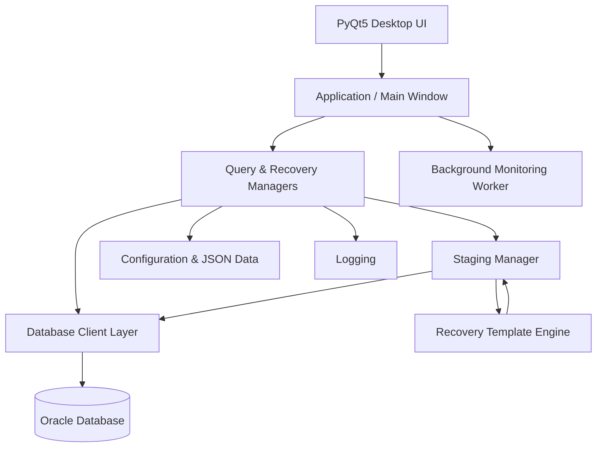

# Monitoring & Recovery Tool

> A desktop operations tool for monitoring Siebel-based business processes, investigating exceptions, staging database changes, and executing controlled recovery actions.

[](https://www.python.org/)
[](https://www.qt.io/qt-for-python)
[](https://www.oracle.com/database/)
[](LICENSE)

## Overview

The **Monitoring & Recovery Tool** is a Python desktop application designed to support operational monitoring and controlled recovery activities for a Siebel-based platform.

Instead of relying on disconnected SQL scripts and manual operational steps, the application brings database connectivity, query management, result inspection, staging, recovery templates, execution history, and operational views into a single GUI workflow.

The application is built with **PyQt5** and **Oracle Database connectivity through `oracledb`**, with a modular separation between the UI, database layer, managers, workers, configuration, and utilities.

## Why this tool?

Operational recovery work often involves a sequence such as:

1. Identify an affected business process.
2. Query the relevant database state.
3. Inspect the returned records.
4. Determine which records require remediation.
5. Generate the required DML/recovery operation.
6. Review the proposed changes.
7. Execute only the intended changes.
8. Preserve enough history to understand what happened.

This application formalizes that workflow and introduces a **staging layer** between investigation and database modification.

## Key Capabilities

### 🔎 Monitoring & Investigation
- Execute predefined operational queries against configured environments.
- Inspect query results through a desktop interface.
- Maintain reusable SQL queries.
- Separate database access from presentation logic.
- Support operational views for pending items and results.

### 🛠️ Controlled Recovery
- Define reusable recovery templates.
- Generate recovery SQL from returned row data.
- Stage proposed changes before execution.
- Selectively include/exclude staged rows.
- Commit staged changes against the appropriate environment.
- Roll back a failed transaction.
- Track recovery status.
- Support controlled revert operations for committed staged changes.

### 🗂️ Operational Management
- Maintain database connections and environment configuration.
- Maintain query definitions.
- Maintain recovery templates.
- Maintain recovery history.
- Manage staging state independently from query execution.

### 🖥️ Desktop Application
The application uses PyQt5 and provides dedicated views for:
- Connections
- Queries
- Results
- Pending items
- Staging
- Recovery templates
- Recovery history
- SQL sheets

## Architecture



### Layer responsibilities

| Layer | Responsibility |
|---|---|
| `ui/` | PyQt5 screens and user interaction |
| `core/` | Database, query, staging and template logic |
| `core/managers/` | Application-level state and operational management |
| `workers/` | Background monitoring work |
| `config/` | Environment/application configuration |
| `data_and_config_files/` | Persistent application data and configuration |
| `utilities/` | Logging and supporting utilities |
| `assets/` | Application resources |
| `build/`, `dist/` | Packaging/build artifacts |

## Recovery Workflow

```text
Database / Operational Query
          │
          ▼
     Result Inspection
          │
          ▼
   Select affected records
          │
          ▼
      Stage Changes
          │
          ▼
 Render Recovery Template
          │
          ▼
   Review / Include / Exclude
          │
          ▼
      Commit Changes
          │
     ┌────┴────┐
     ▼         ▼
  Success    Failure
     │         │
     ▼         ▼
 Committed   Rollback
     │
     ▼
 Recovery History
```

The staging implementation keeps generated SQL, bind variables, environment, query name, row data, inclusion state, and execution status together before the database operation is committed.

## Technology Stack

| Technology | Purpose |
|---|---|
| Python | Application and business logic |
| PyQt5 | Desktop GUI |
| `oracledb` | Oracle database connectivity |
| Pandas | Tabular data processing |
| `regex` | Advanced pattern matching |
| JSON | Local persistence/configuration |
| PyInstaller | Desktop executable packaging |

The current dependency set is defined in `requirements.txt`.

## Project Structure

```text
monitoring-and-recovery-tool/
│
├── app.py
├── recovery.py
├── dump.py
├── python_version.py
├── requirements.txt
│
├── core/
│   ├── db_client.py
│   ├── db_client_isl.py
│   ├── db_config_manager.py
│   ├── query_manager.py
│   ├── staging.py
│   ├── template_engine.py
│   └── managers/
│       ├── connection_manager.py
│       ├── query_manager.py
│       ├── recovery_history_manager.py
│       └── staging_manager.py
│
├── ui/
│   ├── main_window.py
│   ├── connections_view.py
│   ├── queries_view.py
│   ├── results_view.py
│   ├── pending_view.py
│   ├── staging_view.py
│   ├── recovery_templates_view.py
│   ├── recovery_history_view.py
│   └── sql_sheets_view.py
│
├── workers/
│   └── monitoring_worker.py
│
├── config/
├── data_and_config_files/
├── utilities/
├── assets/
├── logs/
└── dist/
```

## Installation

### Prerequisites

- Python 3.x
- Access to the required Oracle environments
- Appropriate Oracle database credentials
- Windows environment if using the packaged desktop executable

### Clone

```bash
git clone https://github.com/saadahmed388/monitoring-and-recovery-tool.git
cd monitoring-and-recovery-tool
```

### Create a virtual environment

```bash
python -m venv .venv
```

Windows:

```bash
.venv\Scripts\activate
```

### Install dependencies

```bash
pip install -r requirements.txt
```

## Run

```bash
python app.py
```

The application initializes logging, creates the PyQt5 application, loads the main window, and starts the desktop event loop.

## Database Configuration

Database connectivity is intentionally separated into the core database/configuration components.

Before connecting to an environment, configure the required database parameters according to the configuration files used by the application.

**Do not commit production credentials, passwords, wallet files, or other secrets to source control.**

## Design Principles

### 1. Stage before mutate

Database changes should not be treated as an immediate side effect of query execution. The staging layer creates an explicit review boundary.

### 2. Parameterized execution

Recovery execution is designed around generated SQL plus bind variables rather than relying exclusively on interpolated values.

### 3. Separation of concerns

The UI does not need to know how Oracle connections, queries, staging, or recovery templates are implemented.

### 4. Environment awareness

Database clients are associated with environments, allowing the same operational workflow to target the correct configured database.

### 5. Failure-aware execution

Recovery execution handles commit failures with rollback behavior and records execution status.

## Safety Considerations

This tool can perform database modification operations. It should therefore be treated as an **operations/recovery utility**, not as a general-purpose SQL playground.

Recommended operational safeguards:

- Verify the target environment before committing changes.
- Review staged records before execution.
- Use least-privilege database accounts.
- Keep production credentials outside the repository.
- Test recovery templates in a controlled environment first.
- Maintain backups and established operational recovery procedures.
- Review recovery history after execution.

## Packaging

The repository contains PyInstaller-related specification/build artifacts, including an application spec and generated build/dist directories.

A typical packaging workflow can be based on the existing spec file:

```bash
pyinstaller "Daily Monitoring.spec"
```

Use the repository's existing build configuration when producing the packaged application.

## Logging

Application logging is initialized during startup. Unhandled application exceptions are logged through the configured logger, providing a useful trail for troubleshooting desktop execution issues.

## License

This project is licensed under the **Apache License 2.0**. See [LICENSE](LICENSE).

## Author

**Saad Ahmed**

GitHub: https://github.com/saadahmed388
